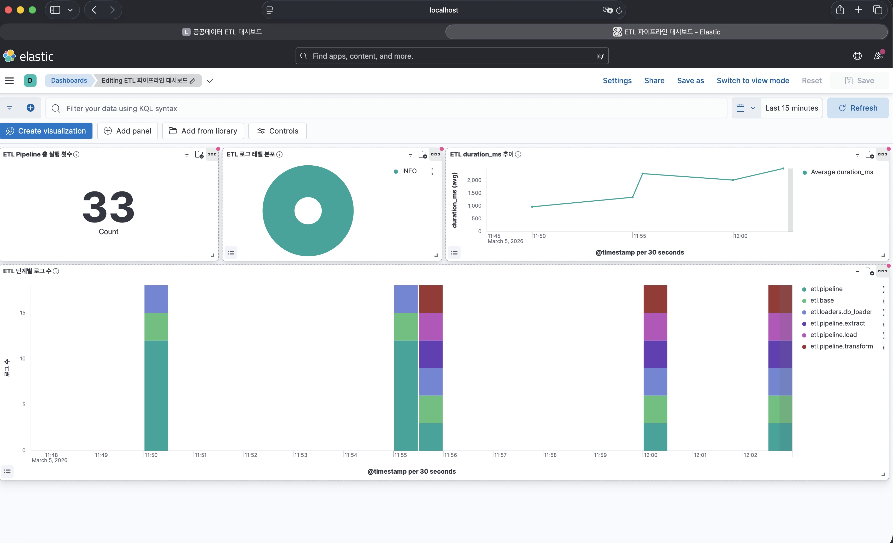

# 공공데이터 수집 ETL + 데이터 정합성 리포트

미세먼지, 날씨, 지하철 공공데이터 API를 수집하여 PostgreSQL에 저장하고, 데이터 품질 리포트를 자동 생성하는 ETL 파이프라인입니다. React 대시보드로 수집 현황과 품질 리포트를 시각화합니다.

## 기술스택

| 영역     | 기술                                                              |
| -------- | ----------------------------------------------------------------- |
| Backend  | Python 3.11, FastAPI, SQLAlchemy, APScheduler, python-json-logger |
| DB       | PostgreSQL 15                                                     |
| Frontend | React 18, Vite, Recharts, React Router                            |
| Logging  | Filebeat, Logstash, Elasticsearch, Kibana (ELK 8.12.2)            |
| Infra    | Docker Compose (v1.25.0 이상, 파일 포맷 v3.7)                    |

## 빠른 시작

### 1. 환경 변수 설정

```bash
cp .env.example .env
```

기본값으로 `USE_MOCK_DATA=true`가 설정되어 있어 API 키 없이도 동작합니다. 실제 API를 사용하려면 `.env`에 키를 입력하고 `USE_MOCK_DATA=false`로 변경하세요.

### 2. Docker Compose 실행

```bash
docker-compose up --build
```

> **참고**: devcontainer 환경에서는 `sudo docker-compose up --build`로 실행하세요.
> 코드 변경 후 반영하려면 `--build` 옵션을 붙여 다시 실행해야 합니다 (bind mount 미사용).

3개 서비스가 기동됩니다:

| 서비스        | URL                   | 설명                       |
| ------------- | --------------------- | -------------------------- |
| Frontend      | http://localhost:3000 | React 대시보드             |
| Backend       | http://localhost:8000 | FastAPI (Swagger: `/docs`) |
| PostgreSQL    | localhost:5432        | DB                         |
| Kibana        | http://localhost:5601 | 로그 시각화                |
| Elasticsearch | http://localhost:9200 | 로그 저장소                |

### 3. ETL 수동 실행

```bash
# 전체 파이프라인
curl -X POST http://localhost:8000/api/etl/run

# 특정 소스만
curl -X POST http://localhost:8000/api/etl/run \
  -H "Content-Type: application/json" \
  -d '{"sources": ["air_quality"]}'
```

또는 대시보드에서 **ETL 수동 실행** 버튼을 클릭합니다.

## 프로젝트 구조

```
etl-public-data/
├── docker-compose.yml
├── .env.example
├── backend/
│   ├── main.py                      # FastAPI + APScheduler 엔트리포인트
│   ├── config.py                    # 환경변수 관리
│   ├── db/
│   │   ├── database.py              # SQLAlchemy 엔진/세션
│   │   ├── models.py                # ORM 모델
│   │   └── migrations.py            # 스키마 버전 관리
│   ├── etl/
│   │   ├── context.py               # run_id ContextVar (스레드별 추적 ID)
│   │   ├── base.py                  # BaseExtractor / BaseTransformer
│   │   ├── extractors/              # 미세먼지, 날씨, 지하철 추출기
│   │   ├── transformers/            # 결측치 보간, 지역 매핑, 스키마 정규화
│   │   ├── loaders/db_loader.py     # DB upsert
│   │   └── pipeline.py              # ETL 오케스트레이션 (run_id 생성, duration_ms 측정)
│   ├── quality/
│   │   ├── checker.py               # 품질 검사 (null률, 이상치, 중복)
│   │   ├── report_generator.py      # HTML/Markdown 리포트 생성
│   │   └── templates/report.html    # Jinja2 템플릿
│   ├── catalog/lineage.py           # 데이터 카탈로그 / 리니지
│   └── api/
│       ├── routes.py                # REST API 엔드포인트
│       └── schemas.py               # Pydantic 스키마
│   └── tests/
│       └── test_run_id_logging.py   # 로깅 동작 검증 테스트
├── elk/
│   ├── filebeat/
│   │   └── filebeat.yml             # Docker 컨테이너 로그 수집 → Logstash
│   └── logstash/
│       └── pipeline/
│           └── logstash.conf        # JSON 파싱, ELK 자체 로그 필터링 → Elasticsearch
└── frontend/
    └── src/
        ├── App.tsx
        ├── pages/                   # Dashboard, QualityReport, Catalog
        └── components/              # Charts, DataTable
```

## API 엔드포인트

| Method | Path                          | 설명                                                  |
| ------ | ----------------------------- | ----------------------------------------------------- |
| GET    | `/api/dashboard`              | 수집 현황 요약 (총 레코드, 일별 건수, 최근 실행 로그) |
| GET    | `/api/quality/reports`        | 품질 리포트 목록                                      |
| GET    | `/api/quality/reports/{date}` | 일자별 상세 리포트 (HTML + Markdown)                  |
| GET    | `/api/catalog`                | 데이터 카탈로그 + 리니지                              |
| GET    | `/api/data/{source}`          | 수집 데이터 조회 (`air_quality`, `weather`, `subway`) |
| POST   | `/api/etl/run`                | ETL 파이프라인 수동 실행                              |

## 데이터 소스

| 데이터셋 | 출처                                                                                     | 갱신 주기 |
| -------- | ---------------------------------------------------------------------------------------- | --------- |
| 미세먼지 | [data.go.kr - 대기오염정보](http://apis.data.go.kr/B552584/ArpltnInforInqireSvc)         | 매시간    |
| 날씨     | [data.go.kr - 기상청 단기예보](http://apis.data.go.kr/1360000/VilageFcstInfoService_2.0) | 3시간     |
| 지하철   | [서울 열린데이터 - 교통카드 이용현황](http://openapi.seoul.go.kr:8088)                   | 일 1회    |

## 스케줄

| 작업             | 기본 주기  | 환경변수                                       |
| ---------------- | ---------- | ---------------------------------------------- |
| ETL 파이프라인   | 매시 정각  | `ETL_CRON_HOUR`, `ETL_CRON_MINUTE`             |
| 품질 리포트 생성 | 매일 01:00 | `QUALITY_REPORT_HOUR`, `QUALITY_REPORT_MINUTE` |

## 로깅 구조

모든 백엔드 로그는 JSON 형식으로 출력됩니다 (`python-json-logger` 사용). `extra={}` 로 전달한 필드는 JSON 최상위 키로 분리됩니다.

```json
{"message": "[air_quality] Extract complete", "rows": 40, "duration_ms": 312, "timestamp": "2026-03-04T10:30:00.123+09:00", "level": "INFO", "logger": "etl.pipeline.extract", "run_id": "a1b2c3d4", "service": "etl-backend"}
```

### 로거 계층

| 로거 | 위치 | 담당 |
| ---- | ---- | ---- |
| `etl.pipeline.extract` | `etl/pipeline.py` | Extract 단계 완료 요약 |
| `etl.pipeline.transform` | `etl/pipeline.py` | Transform 단계 완료 요약 |
| `etl.pipeline.load` | `etl/pipeline.py` | Load 단계 완료 요약 |
| `etl.pipeline` | `etl/pipeline.py` | Pipeline complete / failed |
| `etl.base` | `etl/base.py` | HTTP API 호출 세부 (재시도 포함) |
| `etl.loaders.db_loader` | `etl/loaders/db_loader.py` | DB upsert 세부 |

> `etl.base`는 Extract의 세부 동작, `etl.loaders.db_loader`는 Load의 세부 동작.
> Kibana에서 `logger: etl.*` 로 전체 ETL 로그를 한번에 조회 가능.

**고정 필드** (모든 로그):

| 필드 | 포함 위치 | 설명 |
| ---- | --------- | ---- |
| `timestamp` | 전체 로그 | KST 기준 ISO 8601 타임스탬프 |
| `level` | 전체 로그 | INFO / WARNING / ERROR |
| `logger` | 전체 로그 | 로거 계층 (예: `etl.pipeline.extract`) |
| `run_id` | 전체 로그 | ETL 소스 실행 단위 추적 ID (8자리 hex). 파이프라인 외부는 `-` |
| `service` | 전체 로그 | 고정값 `"etl-backend"` |

**extra 필드** (로그 종류별):

| 필드 | 포함 위치 | 설명 |
| ---- | --------- | ---- |
| `rows` | Extract / Transform / Load | 처리 레코드 수 |
| `duration_ms` | 모든 단계 | 단계별 소요시간(ms) |
| `error_type` | ERROR / WARNING | 예외 클래스명 (`type(e).__name__`) |
| `error_msg` | ERROR / WARNING | 예외 메시지 (`str(e)`, JSON 네이티브 문자열) |
| `traceback` | ERROR | 스택 트레이스 (JSON 필드로 직렬화) |
| `retry_exhausted` | HTTP 재시도 로그 | 중간 실패 `false` / 최종 실패 `true` (bool) |

- `etl/context.py`의 `ContextVar`로 스레드별 run_id를 관리하므로 동시 실행 시에도 섞이지 않음
- `main.py`의 `RunIdFilter`가 루트 핸들러에 등록되어 모든 서브 로거(`etl.pipeline.*`, `etl.base`, `etl.loaders.db_loader` 등)에 자동 주입
- Kibana에서 `duration_ms`, `error_type`, `retry_exhausted` 등을 필드 직접 필터/집계로 활용 가능

로깅 검증 테스트 실행:

```bash
cd backend
python -m tests.test_run_id_logging
```

## ELK 스택

Filebeat → Logstash → Elasticsearch → Kibana 파이프라인으로 ETL 로그를 수집·시각화합니다.

| 서비스          | URL                    | 설명                        |
| --------------- | ---------------------- | --------------------------- |
| Elasticsearch   | http://localhost:9200  | 로그 저장소                 |
| Kibana          | http://localhost:5601  | 로그 검색 및 시각화         |

인덱스 패턴: `etl-logs-*` (일별 인덱스, 예: `etl-logs-2026.03.05`)

### Kibana Discover — KQL 검색 문법

**기본 필드 검색**
```
level: "ERROR"
service: "etl-backend"
logger: "etl.pipeline"
```

**특정 run_id 전체 추적**
```
run_id: "dcde5806"
```

**AND / OR / NOT**
```
level: "ERROR" and logger: "etl.pipeline"
level: "INFO" or level: "WARN"
not level: "INFO"
```

**와일드카드**
```
message: "*subway*"
logger: "etl.*"
```

**숫자 범위**
```
duration_ms > 1000
rows >= 500 and rows <= 1000
```

**필드 존재 여부**
```
run_id: *
```

**활용 예시**
```
# 느린 ETL 찾기
duration_ms > 2000

# 지하철 관련 에러
message: "*subway*" and level: "ERROR"

# 특정 실행 전체 로그
run_id: "dcde5806"
```

### Kibana 대시보드

`elk/kibana/create_dashboard.py` 스크립트로 대시보드를 자동 생성합니다.

```bash
# devcontainer 내부에서 실행
python3 elk/kibana/create_dashboard.py

# 대시보드 URL
http://localhost:5601/app/dashboards → "ETL 파이프라인 대시보드"
```



생성되는 패널 4개:

| 패널 | 종류 | 설명 |
| ---- | ---- | ---- |
| ETL Pipeline 총 실행 횟수 | Metric | `etl.pipeline` 로거 이벤트 수 |
| ETL 로그 레벨 분포 | Donut 차트 | INFO / WARNING / ERROR 비율 |
| ETL duration_ms 추이 | Line 차트 | Pipeline 단계 평균 소요시간 추이 |
| ETL 단계별 로그 수 | Stacked Bar | `etl.*` 로거별 시계열 로그 수 |

> 스크립트를 재실행하면 기존 대시보드를 덮어씁니다 (`overwrite=true`).

## 품질 검사 항목

- **Null률**: 필드별 결측치 비율
- **범위 이상치**: 물리적으로 불가능한 값 (예: PM10 > 500, 습도 > 100%)
- **중복 레코드**: 동일 키 조합의 중복 여부
- **종합 점수**: 위 항목을 종합한 0~100 품질 점수

## 스키마 진화

`db/migrations.py`에서 버전 기반 마이그레이션을 관리합니다. 새 마이그레이션 추가:

```python
# db/migrations.py의 MIGRATIONS 리스트에 추가
{
    "version": 3,
    "description": "Add new_column to air_quality",
    "sql": [
        "ALTER TABLE air_quality ADD COLUMN IF NOT EXISTS new_column VARCHAR(100)",
    ],
}
```

서버 시작 시 자동으로 미적용 마이그레이션이 실행됩니다.
